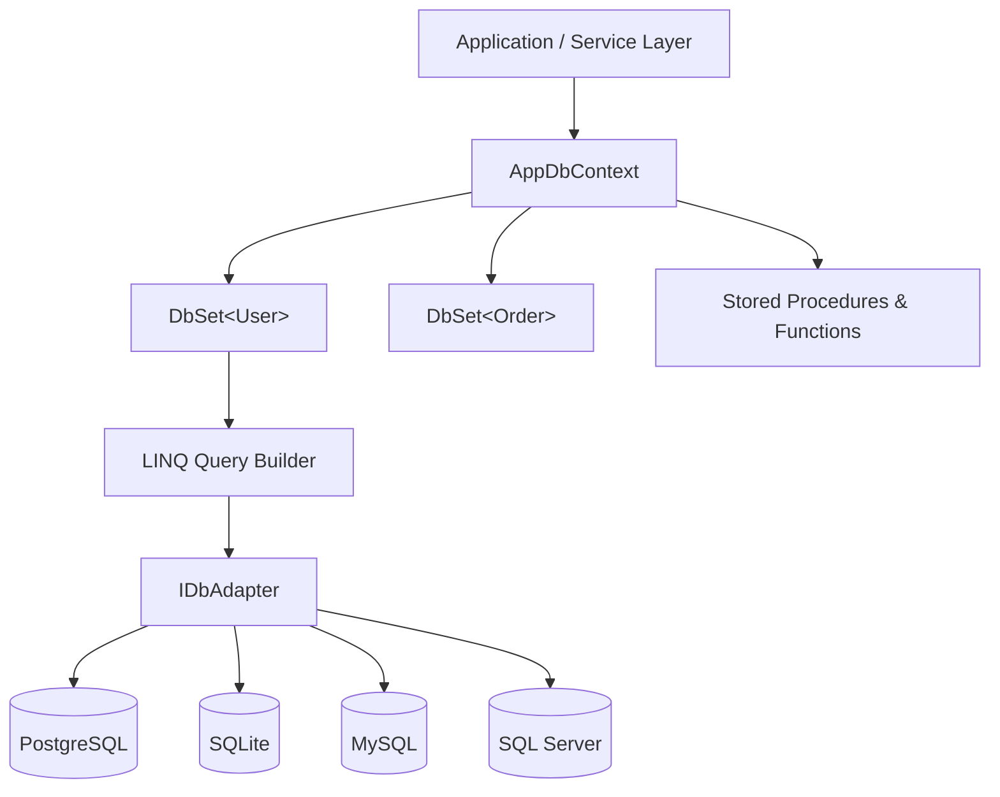

# EntityTS

**EntityTS** is an enterprise-grade, high-performance TypeScript ORM inspired by **Entity Framework Core (EF Core)** and **LINQ**.

It brings the architectural elegance of C# / .NET data access patterns to the TypeScript & Node.js ecosystem—delivering rich type safety, Unit of Work transaction management, native stored procedure execution, and modern cloud-native features like vector search and the transactional outbox pattern.

---

## 🚀 Key Highlights

- **Fluent LINQ-Style Querying**: Chain `.where()`, `.orderBy()`, `.select()`, `.include()`, `.toCursorPage()`, and aggregations with complete compile-time type inference.
- **DbContext & DbSet Pattern**: Organize database entities into strongly-typed contexts with automatic relationship hydration and lifecycle hooks.
- **First-Class Stored Procedures**: Native support for `@StoredProcedure`, `@SqlFunction`, input/output parameters, TVPs (Table-Valued Parameters), and multiple result sets.
- **Universal Multi-Database Support**: Single consistent API for **PostgreSQL** (Neon, CockroachDB), **SQLite** (LibSQL, Turso), **MySQL** (PlanetScale), and **SQL Server (MSSQL)**.
- **Enterprise Reliability**: Built-in **Transactional Outbox Pattern**, **Distributed Idempotency Engine**, **Optimistic & Pessimistic Locking**, and **Global Multi-Tenant Query Filters**.
- **AI-Ready with pgvector**: First-class `@Vector` decorator with nearest-neighbor vector distance searches (cosine, L2, inner product).

---

## 📦 Architecture Overview

---

## Next Steps

- Check out the [Quick Start Guide](./getting-started/quickstart.md) to set up your first DbContext in 2 minutes.
- Learn about configuring [Database Providers](./getting-started/database-providers.md).
- Dive into the [API Reference](./api/index.md).
